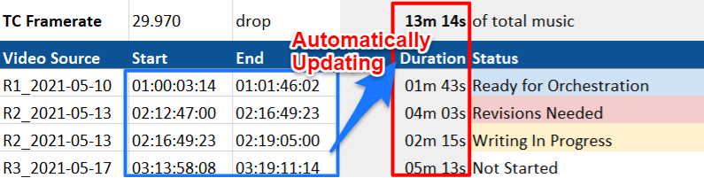
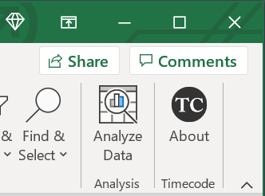

# excel-timecode

Microsoft Excel custom functions (JavaScript) for working with video timecode standards and wall
time durations. Available as an Office Add-In (see instructions below).



**IMPORTANT**: These custom functions are only supported in the latest subscription versions of
Office for Windows, Mac, or the web (NOT in one-time purchase versions of Office 2019 or earlier).

*Using Google Sheets instead? Check out [gsheets-timecode](https://github.com/barndollarmusic/gsheets-timecode)*.

Designed for film & television composers, though these may be useful for anyone who works with
timecode values in Microsoft Excel.

Primary Author: [Eric Barndollar](https://barndollarmusic.com)

This is open source software that is free to use and share, as covered by the
[MIT License](LICENSE).

# Sample Spreadsheet

**IMPORTANT**: Follow installation instructions below to configure this Add-In before opening
the example spreadsheet.

Download [XYZ_Music_Log_Template.xlsx](XYZ_Music_Log_Template.xlsx) for an example cue tracking
spreadsheet that uses these custom timecode functions.

# Installation Instructions



**NOTE**: Fair warning&mdash;you will have to jump through a few hoops to load this Add-In on each
computer that you want to use with Excel.

These installation steps are based on
[these Microsoft instructions](https://docs.microsoft.com/en-us/office/dev/add-ins/publish/host-an-office-add-in-on-microsoft-azure),
so check there for any updated steps if the procedure below isn't working for you.

## Excel for Windows

1. Open Windows Explorer (`⊞ Win + E`)
1. Within the left panel, click your `C:` disk under *This PC*
1. Create a new folder directly under the `C:` drive (**Right Click > New > Folder**), and name the new folder `OfficeAddIns`
1. On the newly created folder, **Right Click > Give access to > Specific people...**
1. Select `Everyone` from the dropdown box and click **Add**
1. Press **Share** button. Make a note of the path that begins with `\\` under `OfficeAddIns` (for example, `\\YOUR-PC-NAME\OfficeAddIns`)
1. Open [ExcelTimecodeManifest.xml](ExcelTimecodeManifest.xml) and press the **Raw** button
1. Save the contents of this file to your computer as `C:\OfficeAddIns\ExcelTimecodeManifest.xml`
1. (Make sure your browser didn't really save it with an extra `.txt` extension as `ExcelTimecodeManifest.xml.txt`)
1. Open Excel and start a new blank workbook
1. Go to **File > Options > Trust Center > Trust Center Settings...**
1. Select **Trusted Add-in Catalogs** on the left
1. Enter the shared folder path (for example, `\\YOUR-PC-NAME\OfficeAddIns`) in the input box next to Catalog URL and press the **Add catalog** button
1. Check the **Show in Menu** box and then click **OK** to close the dialog
1. Click **OK** to close the Options dialog
1. Restart Excel and start another new blank workbook
1. Go the the **Insert** tab in the top ribbon menu and click the **My Add-ins** button
1. Under the *Office Add-ins* title, click the text that says **SHARED FOLDER**
1. Click **excel-timecode** and press **Add**

If successful, you should see a Timecode section all the way to the right of the **Home** tab in the top ribbon, and all these custom functions will now be available.

## Excel for Mac

1. Open [ExcelTimecodeManifest.xml](ExcelTimecodeManifest.xml) and press the **Raw** button
1. Save the contents of this file to your computer to your *Desktop* as `ExcelTimecode.xml`
1. (Make sure your browser didn't really save it with an extra `.txt` extension as `ExcelTimecode.xml.txt`)
1. Open a Finder window to your Desktop so you can see this downloaded file
1. **File > New Finder Window** to open another window
1. Hold down the **Option** key, then click the **Go** menu and select **Library**, which opens the
folder `/Users/<username>/Library/`
1. Navigate down to `/Users/<username>/Library/Containers/com.microsoft.Excel/Data/Documents/wef` (and if the last `wef` folder doesn't exist, create it)
1. Drag `ExcelTimecode.xml` from the first Finder window into the `wef` folder in the second. (Note if you are updating to a newer version and replacing this file, you may need to close all Office programs and either force quit Finder or restart your computer for macOS to let you replace the older file).
1. Open Excel and start a new blank workbook
1. Go the the **Insert** tab in the top ribbon menu and click the **dropdown arrow** next to *My Add-ins* and select **excel-timecode** (which should show up in the dropdown menu underneath *Developer Add-ins*)

If successful, you should see a Timecode section all the way to the right of the **Home** tab in the top ribbon, and all these custom functions will now be available.

## Updating to a Newer Version

I'll keep a version log below of any substantial changes (bug fixes or new features) that would require repeating the above instructions. You will also need to follow these steps to [Clear the Office Cache](https://docs.microsoft.com/en-us/office/dev/add-ins/testing/clear-cache) before updating.

| Date       | Version Notes   |
| -----------| --------------- |
| 2021-07-01 | Initial release |

# Using custom functions
The last 2 arguments to every function below are `frameRate` and `dropType` values.

Data validation list of supported `frameRate` values (see template above for example usage):
```
23.976,24.000,25.000,29.970,30.000,47.952,48.000,50.000,59.940,60.000
```
**IMPORTANT**: The `frameRate` value must be **Plain text** type (not a number) and include exactly
2 or 3 decimal digits after a period. This is to avoid any possible confusion over *e.g.* whether
`24` means `23.976` or `24.000`.

Data validation list of `dropType` values (see template above for example usage):
```
non-drop,drop
```

## Most common functions
```JavaScript
=TIMECODE.TC_TO_WALL_SECS("00:00:01:02", "50.00", "non-drop")
```
- Yields `1.04` secs (true seconds of wall time measured from `00:00:00:00`).

```JavaScript
=TIMECODE.WALL_SECS_BETWEEN_TCS("00:00:01:03", "00:02:05:11", "24.00", "non-drop")
```
- Yields `124.33333333...` secs (true seconds of wall time between the timecodes).

```JavaScript
=TIMECODE.WALL_SECS_TO_DURSTR(3765)
```
- Yields `"1h 02m 45s"` (a human-readable duration string). Rounds to nearest second.

```JavaScript
=TIMECODE.WALL_SECS_TO_TC_LEFT(1.041, "50.00", "non-drop")
```
- Yields `"00:00:01:02"`, the timecode of the closest frame that is exactly at or
before (*i.e.* to the left of) the given `wallSecs` value of `1.041` (true seconds of
wall time measured from `00:00:00:00`).

```JavaScript
=TIMECODE.WALL_SECS_TO_TC_RIGHT(1.041, "50.00", "non-drop")
```
- Yields `"00:00:01:03"`, the timecode of the closest frame that is exactly at or
after (*i.e.* to the right of) the given `wallSecs` value of `1.041` (true seconds of
wall time measured from `00:00:00:00`).

## Other functions (more advanced)
```JavaScript
=TIMECODE.TC_ERROR("01:02:03:04", "23.976", "non-drop")
```
- Yields an error string if timecode (or format) is invalid, or an empty string otherwise.

```JavaScript
=TIMECODE.TC_TO_FRAMEIDX("00:00:01:02", "50.00", "non-drop")
```
- Yields `52` (the timecode refers to the 53rd frame of video, counting from `00:00:00:00` as
index 0). Dropped frames are not given index values (so in 29.97 drop, `00:00:59:29` has index
`1799` and `00:01:00:02` has index `1800`).

```JavaScript
=TIMECODE.FRAMEIDX_TO_TC(52, "50.00", "non-drop")
```
- Yields `"00:00:01:02"`, the timecode of the given frame index.

```JavaScript
=TIMECODE.FRAMEIDX_TO_WALL_SECS(52, "50.00", "non-drop")
```
- Yields `1.04` secs (true seconds of wall time measured from `00:00:00:00`).

```JavaScript
=TIMECODE.WALL_SECS_TO_FRAMEIDX_LEFT(1.041, "50.00", "non-drop")
```
- Yields `52`, the frame index of the closest frame that is exactly at or
before (*i.e.* to the left of) the given `wallSecs` value of `1.041` (true seconds of
wall time measured from `00:00:00:00`).

```JavaScript
=TIMECODE.WALL_SECS_TO_FRAMEIDX_RIGHT(1.041, "50.00", "non-drop")
```
- Yields `53`, the frame index of the closest frame that is exactly at or
after (*i.e.* to the right of) the given `wallSecs` value of `1.041` (true seconds of
wall time measured from `00:00:00:00`).

# Acknowledgements &amp; Other Resources

Special thanks to [Eduardo Delgado](https://sonicscapeproductions.com/) for suggesting improvements
and helping with the Excel version.

Find the link to Shie Rozow's **SR Show Cue Manager** Google Sheet template along with excellent
advice for collaborative project management and organization:
*[Scoring Films on a Shoestring Budget](https://shierozow.com/scoring-films-on-a-shoestring-budget/)*

Tim Starnes also has a great *[File Naming and Organization](https://youtu.be/z88kv81yKTk)* video on
the Cinesamples YouTube channel.

# Contributing Code

For the custom functions themselves, please first update and test your changes to this
repository: [gsheets-timecode](https://github.com/barndollarmusic/gsheets-timecode).

# Testing with Excel for Local Code Development

See
[Clear the Office Cache](https://docs.microsoft.com/en-us/office/dev/add-ins/testing/clear-cache)
for instructions on clearing all previous sideloaded Add-Ins.

Note that local development scripts use [LocalDevManifest.xml](LocalDevManifest.xml), which serves
from the local development server (`localhost:3000`) instead of the production version
([ExcelTimecodeManifest.xml](ExcelTimecodeManifest.xml)).

Open this project in Visual Studio Code.
- **Terminal > Run Task... > Watch**
- **Terminal > Run Task... > Dev Server**
- **View > Run**, then select **Excel Desktop (Edge Chromium)** and hit play button (`F5`).

Or from the command line (run these commands in separate tabs):
```bash
npm run watch
```

```bash
npm run dev-server
```

```bash
npm run start:desktop
```
